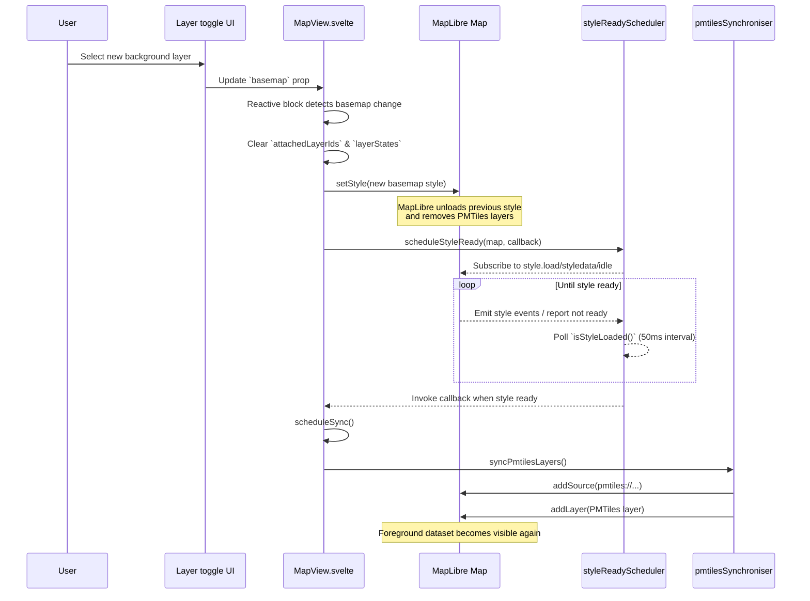

# Dataset lifecycle when switching basemap styles

The following sequence diagram illustrates how PMTiles foreground datasets are handled when the basemap (background layer) changes in `MapView`.

The diagram is based on the logic in `MapView.svelte`, `styleReadyScheduler.ts`, and `pmtilesSynchroniser.ts`, which coordinate the basemap switch and foreground dataset re-attachment.
